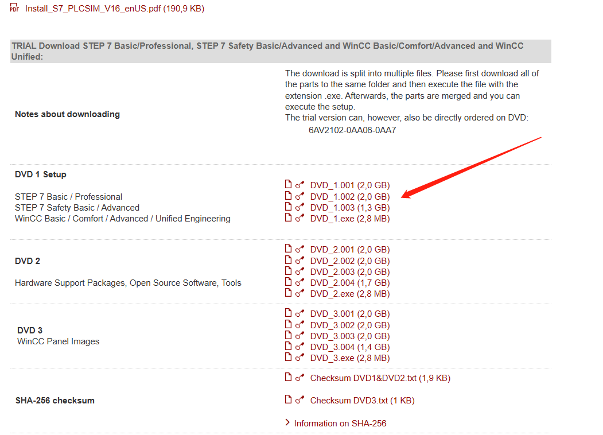

# Screw Fastening Project
## 1. Preparation
### Software
1. **TIA Portal**
    - You are suggested to install [**TIA Portal V16**](https://support.industry.siemens.com/cs/document/109772803/simatic-step-7-incl-safety-and-wincc-v16-trial-download?dti=0&dl=en&lc=zh-CN) or any newest version to **control PLC**
    
2. **SINA_POS**
    - Install [**SINA_POS**](https://support.industry.siemens.com/cs/document/109475044/sinamics-communication-blocks-drivelib-for-reading-and-writing-drive-data-within-tia-portal-context?dti=0&lc=en-WW) to **control motor**
3. **V-ASSISTANT**
    - Install [**V-ASSISTANT**](https://support.industry.siemens.com/cs/document/109738387/sinamics-v-assistant-commissioning-tool?dti=0&lc=en-WW) to **configure motor**
4. **Lingua Franca**
    - Download [**lingua franca**](https://www.lf-lang.org/download) (you can directly download [**Epoch IDE**](https://github.com/lf-lang/lingua-franca/releases/download/v0.4.0/epoch_ide_0.4.0-linux.gtk.x86_64.tar.gz) to avoid set up lf compiler in your system)
5. **ur_rtde**
    - Install [**ur_rtde**](https://sdurobotics.gitlab.io/ur_rtde/) 
    ```linux
    sudo add-apt-repository ppa:sdurobotics/ur-rtde
    sudo apt-get update
    sudo apt install librtde librtde-dev
    ```
6. **Halcon**
    - Install [**Halcon**](https://www.51halcon.com/portal.php) and get the [**trial license**](https://www.51halcon.com/plugin.php?id=lichelper:index) for the software if you have not purchased yet
    - Add Halcon to your system environment path
7. **Opencv**
    - Install [**Opencv**](https://github.com/opencv/opencv/tree/4.8.0)
8. **AprilTag(Optional)**
    - Install [**AprilTag**](https://github.com/AprilRobotics/apriltag) for detection
9. **Imaging Source(Optional)**
    - Install [**Imaging Source**](https://www.theimagingsource.com/zh-hans-cn/support/download/) for configuration of camera and IP 
* Details for software configuration can be found in the document attached in the website
### Hardware
1. **PLC S7-1200**
    
2. **V90**
    
3. **3 SERVO motor**
    
4. **Imaging Camera**
    
5. **3D Objects**
    
6. **Screwer**
    
7. **Air pump**
    
8. **Power**
    


## 2. Setup
1. Wire connection
    - Details can be found in this [**file**]()
    - CPU 1212C wiring diagram: [**link**](https://support.industry.siemens.com/cs/mdm/91696622?c=60466571019&lc=en-WW)
2. Software setup
    - After you install **SINA_POS**, configuration can be found in [**here**](https://support.industry.siemens.com/cs/attachments/109747655/109747655_Simple_EPOS_Function_Block_Doc_V1.2.pdf)

## 3. Related Code and Items
1. [**V90 control code**](./V90_Control_Platform)(open with TIA Portal)
2. [**Screwing Cpp code**](./Cpp_Code/main.cpp)
3. [**Screwing LF code**](./LF_Code/test/src/ScrewFastening.lf)
4. [**3D Object - Platform**](./3D_Objects/Platform/)
5. [**3D Object - Button Box**](./3D_Objects/Button_Box/)
6. [**3D Object - Camera Base**](./3D_Objects/Camera_Base/)

